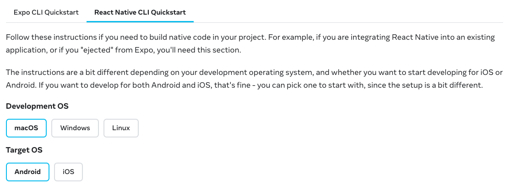

# Start Project

## Prerequisites

In case you've never developed React Native apps before - you'll need to install Android and iOS development environment. Open link below, select **React Native CLI** tab and install everything needed for iOS and Android.

- 📚 [React Native Environment Setup Guide](https://reactnative.dev/docs/next/environment-setup)



Note: we will **node version 14** for this project.

## Clone this project

Most likely you've done it already, but just to be sure😄

- 🔗 [Repository link](https://github.com/evgeniyaglovatskaya/detox-workshop)

```sh
git clone git@github.com:evgeniyaglovatskaya/detox-workshop.git && cd detox-workshop
```

## Install Detox Command Line Tools

```sh
npm install -g detox-cli
```
## Install applesimutils (iOS only)

A collection of utils for Apple simulators, Detox uses it to query and communicate with the simulator.

```sh
brew tap wix/brew
brew install applesimutils
```

## Install dependencies

```sh
// Install dependencies
cd DetoxWorkshop && npm install

// Install pods
cd ios && pod install
```

## Start projects

```sh
// Start Metro in new terminal
npx react-native start

// Starting iOS (should launch simulator automatically)
npx react-native run-ios

// Launch Android emulator (note: it is better to use AOSP emulators)
emulator -list-avds

emulator @emulatorNameFromPrevious

// Starting Android
npx react-native run-android
```

If everything went well - you will see app with movies running in iOS and Android simulators.
